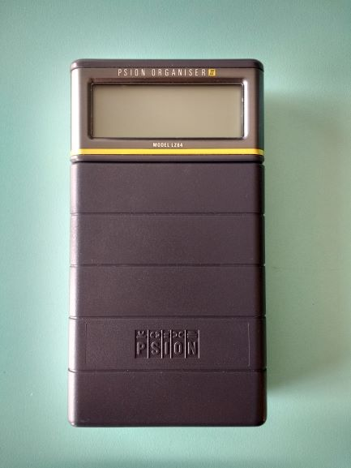

# Psion Organiser II Schematics

Redrawing the Psion Organiser II XP Schematics from an old poor quality FAX and following the description in the Psion Organiser Technical Reference Manual. There are some slight differences between the manual and the FAX. The power-on/standby circuit was not shown in the FAX, so I traced it from an issue 2 board and I'm guessing where I'm not sure. The FAX is for issue 3 boards, these later boards moved one of the clock generators to the power PCB.

The new schematics are drawn in KiCAD, which is open source and free to download.

Power PCB:

